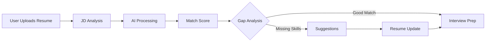
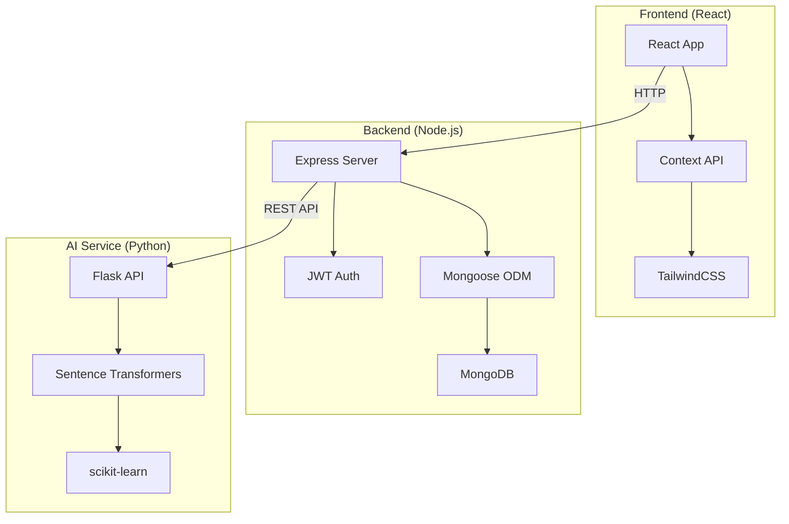

<div align="center">

# 🤖 Ai_Craft: Intelligent Resume Builder & Interview Prep

### *Your AI-powered career companion* ✨

[](https://github.com/man1655/Ai_Craft)
[](LICENSE)
[](https://nodejs.org/)
[](https://python.org)
[](CONTRIBUTING.md)

*Building better careers, one resume at a time*

[🚀 Live Demo](#) • [📖 Documentation](#) • [📦 Installation](#installation) • [🐛 Report Bug](#) • [💡 Request Feature](#)

</div>

---

## 📋 Table of Contents

- [🌟 Overview](#-overview)
- [✨ Key Features](#-key-features)
- [🎯 How It Works](#-how-it-works)
- [🏗️ Architecture](#-architecture)
- [📁 Directory Structure](#-directory-structure)
- [🚀 Quick Start](#-quick-start)
- [⚙️ Configuration](#-configuration)
- [📊 API Reference](#-api-reference)
- [🤝 Contributing](#-contributing)
- [📄 License](#-license)
- [👨‍💻 Maintainers](#-maintainers)

---

## 🌟 Overview

<div align="center">


</div>

**Ai_Craft** is an intelligent career acceleration platform that transforms your job search experience. It combines a professional resume builder with AI-powered analysis to help you:

- 📝 **Create ATS-optimized resumes** with real-time preview
- 🔍 **Analyze resume-JD match** with semantic AI scoring
- 🎤 **Prepare for interviews** with role-specific questions
- 📈 **Track your progress** with detailed insights and analytics

**Why Ai_Craft?**
> Traditional resume builders only format content. Ai_Craft understands it. Using advanced NLP, we help you identify skill gaps, optimize keywords, and prepare effectively for interviews—all in one platform.

---

## ✨ Key Features

### 🎨 **Smart Resume Builder**
| Feature | Description |
|---------|-------------|
| **Live Preview** | See changes in real-time as you edit |
| **ATS-Friendly Templates** | 10+ professionally designed templates |
| **Multi-Format Export** | Download as PDF, DOCX, or plain text |
| **Cloud Storage** | Auto-save drafts to your account |

### 🔬 **AI-Powered Analysis**
| Capability | Benefit |
|------------|---------|
| **Match Score (0-100%)** | Understand how well your resume fits a job |
| **Keyword Gap Analysis** | Identify missing crucial skills |
| **Skill Recommendations** | Get suggestions for improvement |
| **ATS Compliance Check** | Ensure your resume passes automated screening |

### 🎯 **Interview Preparation**
| Tool | Purpose |
|------|---------|
| **Dynamic Q/A Generator** | Questions tailored to specific roles |
| **Answer Assistant** | AI-powered hints and ideal answers |
| **Mock Interview Mode** | Practice with timed sessions |
| **Performance Analytics** | Track your improvement over time |

### 🔒 **Security & Management**
| Feature | Details |
|---------|---------|
| **JWT Authentication** | Secure login with token-based auth |
| **Email Verification** | OTP-based account confirmation |
| **Password Recovery** | Secure reset flow |
| **Data Privacy** | Your data stays yours |

---

## 🎯 How It Works



1. **Upload/Create Resume** → Start with existing or build new
2. **Paste Job Description** → AI analyzes requirements
3. **Get Instant Score** → See match percentage
4. **Review Gaps** → Identify missing keywords/skills
5. **Optimize** → Update resume with suggestions
6. **Prepare** → Generate interview questions
7. **Practice** → Use mock interview tools

---

## 🏗️ Architecture

<div align="center">



</div>

---

## 📁 Directory Structure

```bash
Ai_Craft/
├── 📁 User-Authentication-MERN-main/      # Main Application
│   ├── 📁 client/                         # React Frontend
│   │   ├── 📁 src/
│   │   │   ├── 📁 components/             # React Components
│   │   │   ├── 📁 pages/                  # Application Pages
│   │   │   ├── 📁 context/                # State Management
│   │   │   ├── 📁 utils/                  # Helper Functions
│   │   │   └── 📁 assets/                 # Images, Styles
│   │   ├── 📁 public/
│   │   └── package.json
│   ├── 📁 server/                         # Node.js Backend
│   │   ├── 📁 controllers/                # Route Controllers
│   │   ├── 📁 models/                     # Mongoose Models
│   │   ├── 📁 middleware/                 # Custom Middleware
│   │   ├── 📁 routes/                     # API Routes
│   │   ├── 📁 config/                     # Configuration
│   │   └── index.js                       # Entry Point
│   └── README.md
├── 📁 ai_engine/                          # Python AI Service
│   ├── 📁 models/                         # ML Models
│   ├── 📁 utils/                          # AI Utilities
│   ├── app.py                             # Flask App
│   ├── requirements.txt
│   └── model.py                           # Model Loader
├── 📁 docs/                               # Documentation
├── 📁 tests/                              # Test Suites
├── .gitignore
├── LICENSE
└── README.md                              # You are here
```

---

## 🚀 Quick Start

### Prerequisites

Before you begin, ensure you have installed:

| Software | Version | Installation Guide |
|----------|---------|-------------------|
| **Node.js** | ≥14.x | [Download](https://nodejs.org/) |
| **Python** | ≥3.8 | [Download](https://python.org) |
| **MongoDB** | ≥4.4 | [Install Guide](https://docs.mongodb.com/manual/installation/) |
| **npm** | ≥6.x | Comes with Node.js |
| **pip** | ≥21.x | Comes with Python |

### Installation Guide

#### **Step 1: Clone Repository**
```bash
git clone https://github.com/man1655/Ai_Craft.git
cd Ai_Craft
```

#### **Step 2: Backend Setup**
```bash
cd User-Authentication-MERN-main/server
npm install
```

#### **Step 3: Frontend Setup**
```bash
cd ../client
npm install
```

#### **Step 4: AI Engine Setup**
```bash
cd ../../ai_engine
python -m venv venv

# Windows
venv\Scripts\activate

# macOS/Linux
source venv/bin/activate

pip install -r requirements.txt
```

---

## ⚙️ Configuration

### Environment Variables

Create the following `.env` files:

**1. Backend (server/.env)**
```env
# Server
PORT=5000
NODE_ENV=development

# Database
MONGO_URI=mongodb+srv://<username>:<password>@cluster.mongodb.net/aicraft?retryWrites=true&w=majority

# Security
JWT_SECRET=your_super_secret_jwt_key_change_this
JWT_EXPIRE=7d

# Services
CLIENT_URL=http://localhost:5173
AI_SERVICE_URL=http://localhost:8000

# Email (for notifications)
EMAIL_HOST=smtp.gmail.com
EMAIL_PORT=587
EMAIL_USER=your_email@gmail.com
EMAIL_PASS=your_app_password
```

**2. Frontend (client/.env)**
```env
VITE_API_URL=http://localhost:5000/api
VITE_AI_SERVICE_URL=http://localhost:8000
VITE_APP_NAME=Ai_Craft
```

**3. AI Service (ai_engine/.env)**
```env
FLASK_ENV=development
FLASK_APP=app.py
MODEL_PATH=models/sentence-transformers
PORT=8000
```

### Running the Application

Open **three separate terminal windows**:

**Terminal 1: Backend**
```bash
cd User-Authentication-MERN-main/server
npm start
# Server running on http://localhost:5000 ✅
```

**Terminal 2: Frontend**
```bash
cd User-Authentication-MERN-main/client
npm run dev
# Frontend running on http://localhost:5173 ✅
```

**Terminal 3: AI Engine**
```bash
cd ai_engine
source venv/bin/activate  # or venv\Scripts\activate
python app.py
# AI Service running on http://localhost:8000 ✅
```

**📱 Access the application at:** `http://localhost:5173`

---

## 📊 API Reference

### Authentication Endpoints

| Method | Endpoint | Description | Request Body |
|--------|----------|-------------|--------------|
| `POST` | `/api/auth/register` | Register new user | `{email, password, name}` |
| `POST` | `/api/auth/login` | User login | `{email, password}` |
| `POST` | `/api/auth/verify` | Verify email OTP | `{email, otp}` |
| `POST` | `/api/auth/forgot-password` | Request reset | `{email}` |
| `POST` | `/api/auth/reset-password` | Reset password | `{token, password}` |

### Resume Endpoints

| Method | Endpoint | Description |
|--------|----------|-------------|
| `POST` | `/api/resume/create` | Create new resume |
| `GET` | `/api/resume/:id` | Get resume by ID |
| `PUT` | `/api/resume/:id` | Update resume |
| `DELETE` | `/api/resume/:id` | Delete resume |
| `GET` | `/api/resume/user/:userId` | Get user's resumes |

### Analysis Endpoints

| Method | Endpoint | Description | Request Body |
|--------|----------|-------------|--------------|
| `POST` | `/api/analyze/score` | Score resume vs JD | `{resumeText, jobDescription}` |
| `POST` | `/api/analyze/keywords` | Extract keywords | `{text}` |
| `GET` | `/api/analyze/suggestions/:resumeId` | Get improvement tips | |

### Interview Endpoints

| Method | Endpoint | Description | Query Parameters |
|--------|----------|-------------|------------------|
| `GET` | `/api/interview/questions` | Generate questions | `role`, `experience` |
| `POST` | `/api/interview/practice` | Start mock session | |
| `POST` | `/api/interview/analyze` | Analyze answers | |

---

## 🤝 Contributing

We love your input! We want to make contributing to Ai_Craft as easy and transparent as possible.

### **Development Workflow**

1. **Fork** the repository
2. **Clone** your fork:
   ```bash
   git clone https://github.com/YOUR_USERNAME/Ai_Craft.git
   ```
3. **Create a branch**:
   ```bash
   git checkout -b feature/amazing-feature
   ```
4. **Make your changes**
5. **Test thoroughly**
6. **Commit**:
   ```bash
   git commit -m 'Add amazing feature'
   ```
7. **Push**:
   ```bash
   git push origin feature/amazing-feature
   ```
8. **Open a Pull Request**

### **Code Style Guidelines**
- Use meaningful variable names
- Add comments for complex logic
- Follow existing code structure
- Write tests for new features
- Update documentation as needed

---

## 📄 License

This project is licensed under the **MIT License** - see the [LICENSE](LICENSE) file for details.

```
MIT License

Copyright (c) 2024 Ai_Craft Contributors

Permission is hereby granted, free of charge, to any person obtaining a copy
of this software and associated documentation files (the "Software"), to deal
in the Software without restriction, including without limitation the rights
to use, copy, modify, merge, publish, distribute, sublicense, and/or sell
copies of the Software, and to permit persons to whom the Software is
furnished to do so, subject to the following conditions:
...
```

---

## 👨‍💻 Maintainers

<div align="center">

**Man Patel** - [@man1655](https://github.com/man1655)

### **Acknowledgments**
- [Sentence Transformers](https://www.sbert.net/) for semantic analysis
- [React Community](https://reactjs.org/community) for amazing tools
- All our contributors and testers ❤️

---

<div align="center">

### **⭐ Star us on GitHub!**

If you find this project useful, please consider giving it a star on GitHub!

[](https://star-history.com/#man1655/Ai_Craft&Date)

**Made with ❤️ and ☕ by developers for developers**

</div>
